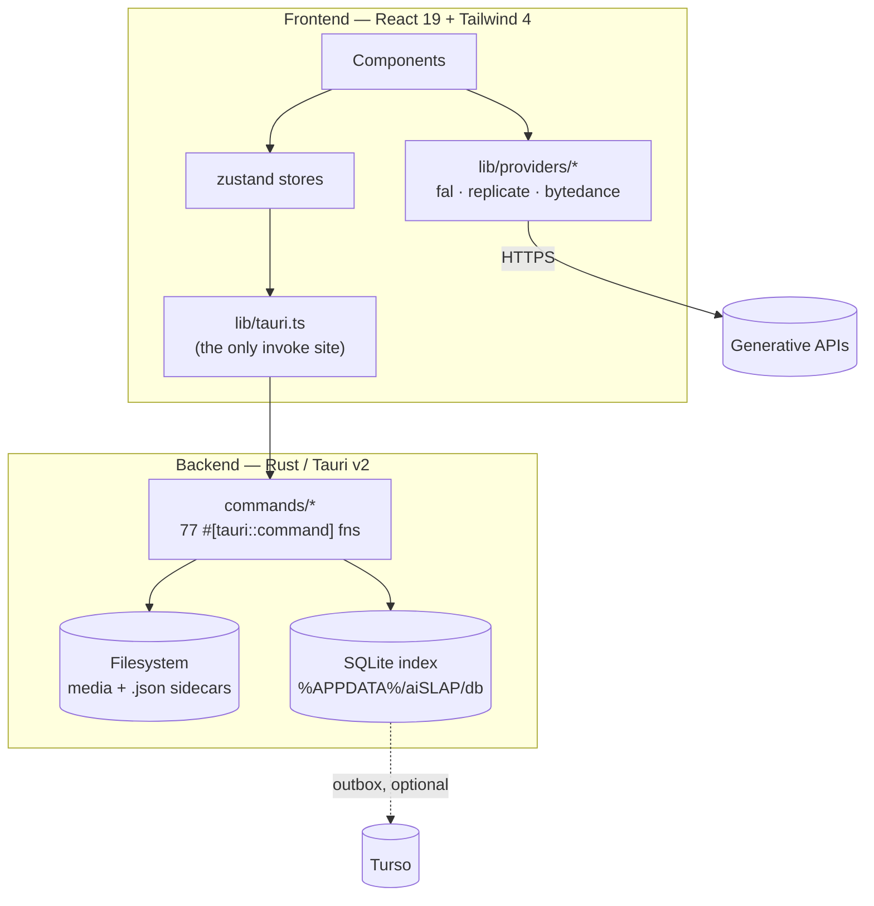

# Architecture

How aiSLAP is put together, and what has to stay true when you change it.

If you read one section, read [§2 The three rules](#2-the-three-rules-that-explain-everything-else)
and [§8 Invariants](#8-cross-cutting-invariants). Almost every subtlety elsewhere in
the codebase follows from those.

---

## 1. The shape of the thing



The frontend owns all provider knowledge and all session state. The backend owns
the filesystem and the index, and knows nothing about which API produced a file.
Between them sits exactly one typed IPC module.

---

## 2. The three rules that explain everything else

**1. Disk is the source of truth.**
A generation produces a media file and a `<stem>.json` sidecar beside it. Those two
are the durable record. The SQLite index, the Turso mirror, video thumbnails and
`metadataCache.ts` are all *derived and disposable* — deleting the index is a
recoverable inconvenience (`project_tags_reindex`, `project_reconcile`), deleting a
sidecar is data loss.

This is why tags live in the sidecar rather than a database: a sidecar travels with
its media through copy, move and rename, so tagging needs no path bookkeeping at all.

**2. The Rust backend is stateless and path-scoped.**
Every command takes absolute paths and returns. There is no "currently open project"
on the Rust side. Consequences you will meet:

- Outbox flushing is frontend-triggered (`db_sync_outbox`), because nothing in Rust
  knows a project is open.
- `project_root_for` walks *up* from a media path to find `project.json`, rather than
  being told the root.
- The backend is provider-agnostic: `domain.rs` keeps `provider` as `Option<String>`
  with no enum, and `config.rs::env_var_for` falls back to `<PROVIDER>_API_KEY` for
  names it has never heard of.

**A refactor that introduces backend session state breaks this rule** and will quietly
invalidate all three consequences.

**3. Provider knowledge lives entirely in TypeScript.**
`src/lib/providers/` is the only place that knows what fal, replicate or BytePlus are.
Adding a provider touches no Rust — see [providers.md](providers.md).

---

## 3. Frontend

### Composition

`main.tsx` → `App.tsx`, which mounts, top to bottom:

```
SessionBar          project / sequence / shot pickers, PRISM SHOT|ASSET toggle
Workbench           the chain editor — one column set per chain link
Timeline            built-in NLE strip
Gallery             version columns · tag view · stacked view · trace view
QueueChecklist | LogWindow
StatusBar           ready · models: N · restoring last session…
SplashScreen        overlays everything until `ready`
```

`ResizeBar`s between the panels are driven by `layoutStore`, which persists sizes to
`localStorage`.

### Components by role

Rather than an alphabetical inventory (53 files, and they move):

| Role | Components |
|---|---|
| **Shell** | `App`, `SessionBar`, `Workbench`, `SplashScreen`, `ResizeBar`, `ColumnResizeHandle`, `CollapsedColumnBar` |
| **Chain columns** | `ModelSettingsColumn`, `PromptColumn`, `RefImagesColumn`, `LatestImageColumn`, `RunColumn`, `CollapsedLinkColumn`, `ChainAddBar` |
| **Gallery** | `Gallery`, `GalleryColumn`, `Thumbnail`, `VersionStack`, `StackedView`, `TagView`, `TagFilterBar`, `TagEditorPopup`, `SelectPickerPopup` |
| **Viewers / editors** | `ImageZoomModal` (hosts `DrawMode`, `CropMode`), `ModelZoomModal` (GLB), `SamPromptModal`, `LlmPromptModal`, `ComparePreview`, `FullscreenModal` |
| **Timeline** | `Timeline`, `TimelineClip`, `TimelineTransport`, `ClipMediaPicker`, `ExportModal` — see [timeline.md](timeline.md) |
| **Diagnostics** | `LogWindow`, `QueueChecklist`, `TraceView`, `ErrorPopup` |
| **Settings** | `SettingsDialog` (app-wide) and `ProjectSettingsDialog` (per-project) — **two different dialogs**; the README used to imply one |
| **Primitives** | `ModalDialog` (centred dialog) vs `FullscreenModal` (full-bleed editor), `IconBtn`, `ToggleGroup`, `InlinePrompt`, `RoleMenu`, `PathContextMenu`, `LazyBoundary` |

### Store ownership

Ten zustand stores. What each owns — and, where it matters, what it must *not*:

| Store | Owns |
|---|---|
| `sessionStore` | project / sequence / shot paths, loaded gallery `columns`, `taggedGroups`, selection, `traceActive`, view mode, `restoringLastSession` |
| `generationStore` | chain `links`, the active link's model/settings/prompts/refs, `iterations`, job list, `pendingOutputs` |
| `modelsStore` | the loaded registry and a `loaded` flag (drives `models: N`) |
| `tagsStore` | vocabulary (`defs`), the derived `colorsByName` map, `activeFilter`, `filterMode` |
| `timelineStore` | clips, playhead, transport, video durations, segment flattening — [timeline.md](timeline.md) |
| `layoutStore` | panel sizes and collapsed columns — persisted to `localStorage` |
| `pricesStore` | cached fal prices plus manual per-endpoint overrides |
| `scriptStore` | the parsed `script.md` |
| `presetsStore` | chain presets |
| `logStore` | the in-app log ring, fed by `lib/consoleCapture.ts` |

Cross-store reads go through `getState()`, not subscriptions — `tagsStore` reaching
into `sessionStore` for the loaded columns is the common case.

### `lib/` by concern

- **IPC** — `tauri.ts`
- **Generation** — `generation/{enqueue,runner,output,prompts}.ts`, `args.ts`, `jobs.ts`
- **Providers** — `providers/{provider,index,fal,replicate,bytedance,tos}.ts`
- **Domain types** — `types.ts`, the single canonical file
- **Paths** — `paths.ts` (pure string manipulation), `prism.ts` (PRISM conventions)
- **Media** — `media.ts`, `assets.ts` (`asset://` URLs), `audio.ts`
- **Cost** — `falPrices.ts`
- **UI plumbing** — `popup.ts`, `dialog.ts`, `dragThreshold.ts`, `osDragDrop.ts`, `icon.tsx`, `colors.ts`, `format.ts`
- **Orchestration** — `actions.ts`, `bootstrap.ts`, `recovery.ts`, `script.ts`, `llm.ts`, `chainValidation.ts`
- **Caching** — `metadataCache.ts`, `coalesce.ts`
- **Diagnostics** — `errors.ts`, `consoleCapture.ts`

---

## 4. Backend

| Module | Responsibility |
|---|---|
| `main.rs` / `lib.rs` | Tauri builder, plugin registration, the command handler list |
| `domain.rs` | Rust mirror of `src/lib/types.ts` — the IPC wire shapes |
| `paths.rs` | `%APPDATA%/aiSLAP/` locations, plus the platform-sensitive `models_dir` resolver |
| `error.rs` | `AppError` / `AppResult`, and `run_blocking` for moving work off the async runtime |
| `fsjson.rs` | JSON reads (lenient and strict) and atomic writes |
| `pricing.rs` | Rust mirror of `falPrices.ts` for the cost rollup |
| `db/` | SQLite index, outbox, Turso push, reconcile |
| `commands/` | Everything reachable over IPC |

Inside `commands/`:

| Module | Responsibility |
|---|---|
| `session.rs` | project/sequence/shot open + create, version allocation, script, shot sidecar fields |
| `rename.rs` | folder rename plus the sidecar path cascade and index prefix remap |
| `walk.rs` | **the** project → sequence → shot → version → media traversal, PRISM resolved |
| `gallery.rs` | version-column and stacked scanning; resolves tags from the index |
| `image.rs` | media-triple copy/move/rename, version-stack moves, reveal-in-explorer |
| `tags.rs` | tag writes, vocabulary, rename/delete sweeps, reindex, migrate, export-by-tag |
| `metadata.rs` | sidecar read/write, and the trash move (there is no hard delete) |
| `media_id.rs` | embedded asset identity (EXIF/PNG text/WebP chunk) and content hashing |
| `prism.rs` | PRISM layout detection and entity resolution |
| `cost.rs` | project-wide cost rollup, backfilling `costUsd` into sidecars |
| `timeline.rs` | latest-media scan and the timeline sidecar |
| `models.rs` | loads the model registry |
| `config.rs` | `config.json`, `app-state.json`, `presets.json`, provider keys |
| `download.rs`, `media.rs`, `pending.rs`, `prompt_history.rs`, `db.rs` | supporting commands |
| `fsutil.rs` | shared path/naming helpers — no commands live here |

**Error handling.** There is one error type (`AppError`) with `#[from]` conversions
and a manual `Serialize` for IPC; there is no `Result<_, String>` anywhere. Two error
strings are load-bearing contracts the frontend matches on — `NOT A PROJECT FOLDER`
and `FILENAME_EXISTS` — and are the only ones. Best-effort work logs via `tracing::warn!`
instead of failing the command.

**Blocking work** belongs inside `run_blocking`. A plain `#[tauri::command] pub fn`
runs on the main thread, which on the network drives this app targets means a stalled
share freezes the UI rather than slowing it.

---

## 5. The IPC contract

`src/lib/tauri.ts` is the **only** place `invoke` is called, and it wraps all 77
commands with real types. A new Rust command is not usable until it has a wrapper
here; a deleted wrapper is how you find dead commands.

The wire shapes are `domain.rs` on one side and `types.ts` on the other, kept in sync
by hand. `domain.rs` uses `#[serde(rename_all = "camelCase")]` so the JSON matches
TypeScript conventions.

---

## 6. Boot

`bootstrap()` in `lib/bootstrap.ts`:

1. Kick off the model registry and presets loads (independent, in parallel).
2. Await `app_state_load` + `config_load` alongside them.
3. Apply colours to CSS variables; seed cached fal prices and overrides.
4. Rebuild the chain from `app-state.json` — the new `chainLinks` array, or a legacy
   single-link state promoted to a one-link chain.
5. Restore the last session's project/sequence/shot paths (fire-and-forget, guarded by
   `restoringLastSession` so the UI can say so).
6. Install the OS drag-drop listener and the app-state persistence subscription.
7. Run orphan recovery against `pending.json`.

`SplashScreen` covers all of it; `StatusBar` reports `ready`, `models: N`, and any
boot error.

**Persistence** is a debounced write of `currentAppState()`, subscribed to a specific
field list on two stores. The gate and `currentAppState` must be kept in step — a
field missing from the gate shows up as *silent non-persistence*, never as a wrong
write.

---

## 7. Domain model

```
project/                     project.json · script.md · SRC/
  <sequence>/                sequence.json
    <shot>/                  shot.json
      SRC/                   inputs dragged in from outside
      v001/ gen001/ …        version folders — one per generation batch
        <media>              the output
        <media>.json         its sidecar
        <media>.thumb.png    poster frame, for video and 3D
```

Under PRISM the shot level is `<entity>/Renders/AI` instead — see [prism.md](prism.md).

**The media triple** is the unit of movement: media + sidecar + thumbnail are copied,
moved, renamed and exported together. Anything that handles one must handle all three,
which is what `sidecar_path` / `thumb_path` / `is_thumb` in `fsutil.rs` exist for.

**Asset identity** is an id embedded *inside* the media file (EXIF UserComment for
JPEG, a text chunk for PNG, a private chunk for WebP, ffmpeg metadata for video) plus
a content hash, both mirrored into the sidecar. It survives renames and moves, and a
copy is deliberately re-identified with a fresh id so two files never share one.

See [storage.md](storage.md) for the on-disk detail — concepts live here, bytes live
there.

---

## 8. Cross-cutting invariants

A checklist to test a change against:

1. **The sidecar write is the durable commit.** The DB write is best-effort enrichment
   and may fail without failing the operation.
2. **Tags live in the sidecar first, the index second.** The index is rebuildable; a
   read may fall back to the sidecar, a write may never skip it.
3. **`sessionStore.shotPath` is the media root**, which under PRISM is
   `<entity>/Renders/AI`. Never assume `basename(shotPath)` is the shot name — use
   `seqShotNames` / `seqShotNamesForMedia`.
4. **The project root is found by walking up to `project.json`**, never by
   `shotPath/../..`. A PRISM root beats a nearer `project.json`.
5. **`lib/tauri.ts` is the sole `invoke` site.**
6. **Model files never declare `kind`** — every shipped file relies on inference from
   its outputs. See [model-registry.md](model-registry.md).
7. **`SRC`, `SEL`, `TRASH`, and `.`/`$`-prefixed directories are never sequences,
   entities or version folders.** Scans are enforced in one place —
   `commands/walk.rs::is_content_dir` — and every traversal goes through it. Five used
   to implement this independently and disagreed; don't add a sixth. There is a second,
   separate gate: `fsutil.rs::list_dirs`, which fills the SEQUENCE dropdown rather than
   walking. A new exclusion has to land in both, or the folder is invisible to every
   scan and still offered as a sequence.
8. **Read-modify-write of `project.json` uses the strict read** (`read_json_strict`).
   The lenient read invents a default that the following write would commit, erasing
   the project id and tag vocabulary.
9. **Provider knowledge stays in TypeScript.** Rust treats `provider` as an opaque
   string.

---

## 9. Deliberate stubs, and known gaps

Told apart so nobody "fixes" a decision, or lives with a bug thinking it is one:

| Thing | Status | Why |
|---|---|---|
| `recovery.ts` handles only fal | **deliberate** | fal is the only provider that hands back a durable request id at submit time. The others fall into a documented "still running / not implemented" branch. |
| `SEL/` folders | **deliberate legacy** | Superseded by the `select` tag. Never a version folder, never written into; `project_tags_migrate` tags their contents once and leaves the files where they are. The gallery still shows a SEL column for projects that have one. |
| `shot_state` / `prompt_history` tables | **deliberate** | Created ahead of the feature that will use them, so it needs no migration. |
| Reconcile doesn't notice an in-place edit | **deliberate** | A file that already carries an id and a hash, and is indexed at the path it sits at, is taken at its word — see [storage.md](storage.md). Reindex still forces a full re-read. |
| A malformed model file vanishes silently | **known gap** | Guarded by a test, not by a runtime error. See [model-registry.md](model-registry.md). |
| The README release table lags on `dev` | **known gap** | The release workflow only rewrites it on `main`. |
| `write_json_atomic` does not `fsync` | **known gap** | Rename-based atomicity without a flush; deliberately unaddressed pending measurement on SMB, where the extra round trip is expensive. |

---

## 10. Build, verify, release

```bash
pnpm install            # pnpm-lock.yaml is the tracked lockfile
pnpm build              # tsc && vite build — the frontend typecheck *and* bundle
pnpm typecheck          # tsc --noEmit, for a faster inner loop
pnpm tauri dev          # the whole app

cd src-tauri
cargo fmt --check
cargo clippy --all-targets -- -D warnings
cargo test              # add -- --test-threads=1 to match CI
```

`.github/workflows/ci.yaml` runs all of the above on every PR and every push to `dev`.
`.github/workflows/release.yaml` builds and publishes on a version bump landing on
`main`; `scripts/versionup.ps1` and `scripts/release.ps1` drive it from a dev machine.

The Rust tests write into the real `%APPDATA%/aiSLAP/db/`, keyed by a per-run uuid,
which is why CI runs them single-threaded.

### Self-update

`tauri-plugin-updater` checks `plugins.updater.endpoints` in `tauri.conf.json` —
GitHub's `releases/latest/download/latest.json` — against a signed manifest that
`release.yaml` produces via `bundle.createUpdaterArtifacts` plus the
`TAURI_SIGNING_PRIVATE_KEY`/`TAURI_SIGNING_PRIVATE_KEY_PASSWORD` repo secrets (keypair
from `pnpm tauri signer generate`; the public half lives in `tauri.conf.json`, not
secret). This key is unrelated to the Apple signing/notarization secrets used for the
macOS build — it's a separate Tauri-native Ed25519 key covering all three platforms.

**Windows update target is the NSIS `.exe`, not the MSI.** Both are still built and
published for manual download, but only the NSIS artifact participates in
auto-update. **`.deb` and MSI installs are manual-download-only** — Tauri's updater
doesn't support `.deb` at all.

The frontend calls the plugin directly (`src/lib/updater.ts`), the same way
`src/lib/dialog.ts` bypasses the `cmd` invoke wrapper for other Tauri plugins. A
background check runs once per launch (`App.tsx`, gated on `Config.autoCheckUpdates`)
and a manual one lives in Settings → General; both funnel a found update through
`updateStore` into `UpdateAvailableDialog`, which prompts before downloading or
relaunching — never silent.
