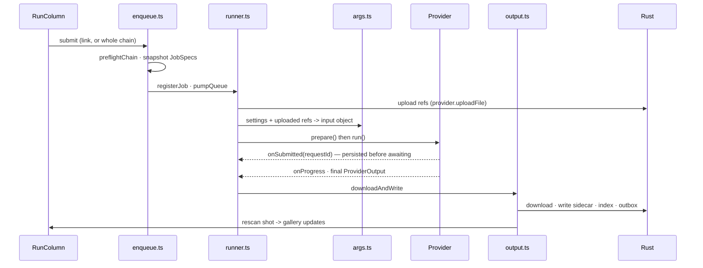

# The generation pipeline

What happens between pressing Run and a file appearing in the gallery. This spans
five modules and is the spine of the app.

---

## 1. Model selection

`ModelPicker` chooses a provider tab, then a family, then a node; the node goes into
`generationStore` as the active link's `model`. `SettingsPanel` renders one control
per entry in the node's `parameters`, seeded from each parameter's `default`.

## 2. Enqueue

`enqueue.ts` **snapshots** the form into one or more `JobSpec`s — a single link, or
every link when running a chain. Snapshotting matters: the user can keep editing while
a job runs, and the job must use the values as they were at submit.

`preflightChain` (`chainValidation.ts`) gates the submit and reports what is missing
rather than failing mid-run. Then `registerJob` + `pumpQueue` run jobs up to
`DEFAULT_MAX_CONCURRENT_JOBS`. `iterations` repeats the whole spec N times, tracked as
`currentIteration`; `QueueChecklist` renders the result live.

## 3. Prompt assembly

`prompts.ts` → `buildCombinedForLink` concatenates, in order and each behind its own
inclusion flag:

- the sequence script segment and the shot script segment (from `scriptStore`, matched
  by heading)
- the sequence prompt (`sequencePromptIncluded`)
- each shot prompt block (`shotPromptsIncluded[]`)

Pieces are trimmed, empties dropped, and joined with blank lines.

> **PRISM subtlety.** Script headings are matched against *entity* names via
> `seqShotNames`. A PRISM shot path ends in `Renders/2dRender/AI`, so matching on the
> path's last segments would compare against `"AI"` and never hit.

## 4. References

A ref carries a `RoleAssignment`, one of:

`source` · `start` · `end` · `mesh` · `element` · `image` · `chain_prev`

- Refs are numbered by position within their row, which is what `@ElementN` and
  `@ImageN` in a prompt refer to.
- `element` groups are *named*, and one member can be flagged frontal.
- `image` pins a ref to a specific slot in an array input.
- `chain_prev` is synthesised at chain-run time from the previous link's output.

Upload goes through `provider.uploadFile`. ByteDance uploads via TOS (`providers/tos.ts`)
because Ark will not accept inline data.

## 5. `args.ts` — settings + refs → the provider input object

Two rules do most of the work here.

**Role routing, with fallthrough.** Each `ref_roles` entry claims refs of its role and
places them at its `api_field`. Refs that **no declared role claims** fall through to
`routeRefsByMediaType`, which places them by media type. This is why a model can name
only *some* of its ref inputs — Seedance's ref2vid node declares just the `image` role
and lets video and audio route themselves.

**The `---` negative-prompt split.** There is no negative-prompt box in the settings
panel. Instead `splitNegativePrompt` looks for a run of three or more dashes anywhere
in the combined prompt: everything before it is the prompt, everything after is the
negative prompt. It is routed **only** when the model declares a `negative_prompt`
parameter (`negativePromptParam`); otherwise the text stays part of the prompt.

This is user-facing behaviour with no UI affordance — it is documented in the README
and the guides for that reason, and it is why several model files declare
`negative_prompt` as a single-option enum (see
[model-registry.md](model-registry.md) §7).

One deliberate exception: some models treat `prompt` as something other than a story
prompt — SAM 3 uses it as a concept filter — so the combined prompt is not leaked into
those inputs.

## 6. Dispatch

`runner.ts` owns the private `jobSpecs` and `abortControllers` maps. `getProvider(name)`
returns a cached provider instance; `prepare()` then `run()` with an `onProgress`
callback.

`hooks.onSubmitted(requestId)` is the **orphan-recovery hook**: the pending record is
written to `pending.json` *before* the result is awaited, so a crash mid-flight leaves
a trail. See §11.

## 7. Output

`output.ts` → `downloadAndWrite`:

- **Filename** from the template, default
  `<date>_<time>_<sequence>_<shot>_<model>_<version>_<minor>`, with `_1`…`_N` appended
  for a batch and an iteration suffix when iterating.
- **`<minor>`** is a 3-digit ordinal that counts up *within one version column*, across
  generations. It is allocated from a monotonic counter in `shot.json`
  (`minorCounters`, keyed by version name) via `shot_version_minor_next` — **not** read
  back off existing filenames. Two reasons: the token can sit anywhere in a
  user-authored template, so parsing it back is guesswork; and the download path
  overwrites on collision rather than erroring, so a misparse destroys a file. Being a
  counter also means trashing a file never frees its number. Allocation is serialised by
  a mutex, because concurrent jobs can target the same column. Templates without the
  token skip the IPC entirely.
- **Version folder** resolved per project shape — `v001` natively, PRISM's configured
  padding otherwise.
- **Highest-resolution pick** when a response returns more files than were requested:
  width×height wins over array position, because "thinking" image models return a
  low-res preview alongside the final image.
- **`inlineText`** outputs (SAM 3 embeddings) are written to a `.txt` beside the media.
- **Sidecar** carries the prompt pieces, the exact `combinedPrompt` that was sent, the
  settings, a snapshot of the refs, the provider response, and `costUsd`.
- **Index** — the asset is upserted into SQLite and queued in the outbox.
- **Rescan** — the shot is rescanned so the gallery picks the file up.

> `output.ts` deliberately imports no stores. That is what lets the orphan-recovery
> driver reuse it outside a live session.

## 8. Chains

Links run in order. A link with `consumesPrev` gets a synthetic `chain_prev` ref
pointing at the previous link's output, and the sidecar records the lineage as a
`ChainMetadataBlock` — which is what `TraceView` later walks.

## 9. Cancellation, errors, trace

One `AbortController` per job. Failures go through `extractErrorMessage` to
`ErrorPopup` and `pushLog` → `LogWindow`. `TraceView` walks a file's reference
lineage backwards across the project (Escape exits; the status bar reads
`tracing · N images`).

## 10. Cost

**Cost is per file, stamped into the sidecar at write time, and never recomputed.**
Every total in the app — tile, column, shot, sequence, project, Sankey — is a sum of
those frozen `costUsd` values. Prices are consulted only to mint a number that doesn't
exist yet; re-deriving from today's table would drift from what was actually billed.

Three sources, in priority order (`buildMetadataRecord` in `output.ts`):

1. **fal's own estimate** — `/v1/models/pricing/estimate`, `historical_api_price`, one
   call per job, divided evenly across the files it produced (fal bills a batch
   uniformly). Never blocks the write.
2. **Local computation** — `perItemPrice`, mirrored in Rust as `pricing.rs`.
3. **Nothing.** `costUsd` is absent and the file counts as unpriced. Better than a
   confident wrong number.

### Resolving a fetched price to a total

An override always wins and is *terminal* — the exact figure for stills, `× duration`
for video, never scaled by anything else. Otherwise the fetched unit decides:

| Unit fal reports | Total | Needs |
|---|---|---|
| request / image / video / generation | flat | — |
| `units` on a **video** output | token formula ↓ | probe |
| `1000 tokens` | token formula ↓ | probe |
| `units` on an image or 3D output | flat | — |
| second | `× duration` | duration |
| megapixel | `× measured MP` | image dimensions |
| `16 frames` | `× fps × duration / 16` | probe |
| `compute seconds` | **unpriceable** | — |

> **`units` is ambiguous, and the output kind resolves it.** For sam-3, seedream v5 and
> gpt-image-2 a fal "unit" is one output. For Seedance 2.0 video it is 1000 ByteDance
> tokens. `isPerItemUnit`'s regex matches `units` via its `unit` alternative, so the
> video-token branch is deliberately tested **first** — before that ordering existed, a
> Seedance video priced at $0.014 instead of ~$1.50.

**The token formula** is ByteDance's own: `tokens = width × height × fps × duration /
1024`, billed per 1000. Established by arithmetic rather than documentation — Seedance
2.0 at $0.014/unit, 720p/24fps/5s, gives 108 kilotokens = $1.512 against a real billed
$1.515. `reconcile_actual_costs` reads fal's billing ledger and is the way to re-check
it if a model's numbers ever look wrong.

**Geometry is measured, never inferred.** `readVideoGeometry` / `readImageGeometry`
probe the written file, because a named preset doesn't know the delivered frame size,
and **no model in the registry declares a frame rate at all** — so without the probe a
token-billed video cannot be priced. The one exception is RunColumn's pre-submit
preview, which has no file yet and assumes 16:9 at the named resolution and 24fps
(`estimateVideoGeometry` / `ASSUMED_PREVIEW_FPS`); the sidecar corrects it seconds
later from the real thing.

**`compute seconds`** (minimax h3-max) is GPU time, reconstructible from no amount of
output geometry. Only fal's estimate or a manual override can price it — **deliberate**
that it stays unpriced otherwise.

### Rollup and reconciliation

`project_cost_scan` walks every media file: a sidecar with `costUsd` is trusted as-is;
one without is priced now, **backfilled** into the sidecar and pushed to the index.
That backfill probes unpriced *videos* (one ffmpeg spawn each, once — they take the
fast path forever after) but not stills, where `megapixels` stays `None`. Shot and
sequence totals are cached into their sidecars, which is what `project_cost_scan_cached`
reloads instantly on project open. `project_cost_lines` (Reports) is read-only and
never computes, so it cannot disagree with the tree.

`reconcile_actual_costs` is the only path that *replaces* a number: it reads fal's
billing-events ledger for each `falRequestId` and writes the real charge plus
`costUsdActual: true`. Needs a billing-scoped fal key.

### Deriving prices from spend

**fal's pricing API has no resolution dimension** — one price per endpoint,
even for the 33 endpoints in the registry that offer a resolution choice, several
of which really cost ~2× at their top tier. Modelling each vendor's formula only
reaches so far: ByteDance's token maths is knowable, minimax's `compute seconds`
is GPU time and knowable by nobody.

`db::derive::pricing_derive` inverts it. Group generations by
`(endpoint, resolution)`, divide what fal billed by what was produced, and read
the rate off the group — $/sec for video (matching how an override is applied to
video), $/output otherwise. No vendor formula, no per-model configuration, and it
prices the models no formula can.

- **Only `cost_usd_actual` rows are averaged.** That column marks a cost that came
  from fal's billing ledger rather than our own estimate. Averaging estimates would
  derive the price table from the price table. `assets_cost_update` takes the flag
  explicitly, and an estimate never clears an actual already on a row.
- **Median, not mean** — one retried or partially-billed job would drag a mean and
  leave no trace.
- **Reads the remote index when Turso is configured**, so the table reflects the
  whole team's spend; falls back to every local project index otherwise.
- **Nothing is applied unseen.** Every proposal carries its sample count, min/max
  spread and total billed. Only rows with ≥3 samples and a spread under 1.25×
  are pre-selected; the rest are shown and left to a human.
- A reconciled video with **no recorded duration** yields no rate at all — dividing
  by a guess would bake the guess into everyone's sheet. Counted as `unusable`.

The price table itself is shared across the team — see
[storage.md](storage.md) § The shared price sheet.

## 11. Orphan recovery

`recovery.ts` reads `pending.json` at boot and reconciles anything that was in flight
when the app died.

> **Deliberately fal-only.** fal is the only provider that returns a durable request
> id at submit time, so it is the only one whose in-flight job can be re-attached. The
> others fall into a documented "still running / not implemented" branch. This is a
> decision, not an oversight.
