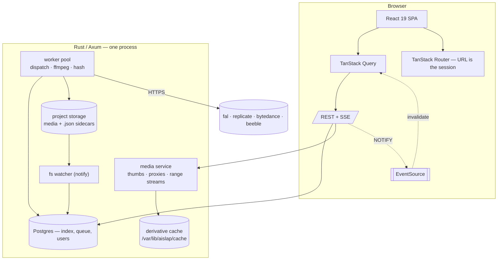

# aiSLAP 2 — hosted rebuild plan

Ground-up rebuild of aiSLAP as a **self-hosted browser application** for a single
studio, running on one server with full access to the project storage.

Handoff document. Read top to bottom once; §16 is the build order.

Source of the requirements: the current desktop app's `docs/` set (architecture,
generation-pipeline, storage, providers, model-registry, prism, tags, tabs, timeline,
styling) plus the in-flight CONTEXT page plan. Every invariant worth keeping is
restated here, so this file stands alone.

---

## 1. Target deployment

```
one Linux server (studio machine or VM)
  ├─ project storage mounted at /mnt/projects  (local disk, or the SMB share)
  ├─ docker compose: app + postgres + caddy
  └─ 5–20 named users on the studio LAN, browser only
```

- **One installation, one studio.** No tenancy, no cloud, no per-user machines.
- **Full disk access is the premise**, not a workaround: the server reads and writes
  the real project tree, and PRISM keeps owning that tree.
- Users bring a browser. Nothing is installed on a workstation.
- Outside access, if wanted, is a WireGuard/Tailscale problem, not an app problem.

This single change removes the three hardest constraints the desktop app worked
around: every machine having its own index, secrets living on every workstation, and
the backend having no idea a project was open.

---

## 2. Platform decisions

| Layer | Choice | Why | Rejected |
|---|---|---|---|
| Server | **Rust + Axum + Tokio** | ~9k lines of the existing Rust (walk, media identity, thumbs, interchange, pricing, PRISM resolution) ports nearly verbatim, and the server's hot path *is* streaming bytes, hashing multi-GB video and fanning out fs work. | Node/Bun (loses that code, worse at hash/stream throughput); Go (rewrite with no gain); keeping Tauri (it is the thing being removed) |
| DB | **PostgreSQL 17** + `sqlx` | Real concurrent writers, `FOR UPDATE SKIP LOCKED` for the job queue, `LISTEN/NOTIFY` for fan-out, `tsvector` prompt search, advisory locks for version allocation. One container. | SQLite (single writer becomes the bottleneck the moment two artists generate); Turso (it existed only because there was no server — delete it) |
| Job queue | **Postgres table + in-process worker pool** | A job row *is* the pending record, so orphan recovery stops being a special case and stops being fal-only. Survives restart by construction. | Redis/NATS (a second dependency for a queue that never exceeds thousands of rows/day) |
| Realtime | **SSE** (`GET /api/events`) | One-way server→browser is all this needs; auto-reconnect is free, proxies don't fight it. Postgres `NOTIFY` feeds the broadcaster so a second app process stays possible. | WebSocket (bidirectional cost with no bidirectional need); polling |
| Frontend | **React 19 + Vite + TS + Tailwind 4** | Keep. The UI is dense, custom and already written in this idiom; the styling doc's token/primitive system carries over unchanged. | Next.js (SSR buys nothing for an authenticated app-shell; complicates the Rust split) |
| Routing | **TanStack Router** | The URL becomes the session (`/p/:project/:sequence/:shot?mode=generate`). This is what deletes the entire tab-proxy subsystem — a browser tab *is* a tab. | Hand-rolled state-as-session (the thing being replaced) |
| Server state | **TanStack Query**, invalidated by SSE events | Caching, dedupe, background refetch and optimistic writes are the whole problem here. | zustand for server data (what the desktop app does, and why it has `metadataCache.ts` and a coalescer) |
| UI state | **zustand**, small stores, no cross-store reads | Panel sizes, modals, selection. | Redux, context trees |
| Gallery | **TanStack Virtual** | Non-negotiable: a shot is 100–500 tiles and the desktop app mounts all of them. | Infinite-scroll libraries |
| API types | **`ts-rs`** emitting TS from the Rust wire structs, + one generated client module | Keeps the desktop app's best rule ("one IPC module, hand-typed") and removes the hand part. `domain.rs`/`types.ts` drift becomes a compile error. | tRPC (needs a TS server); OpenAPI codegen (heavier, but acceptable fallback via `utoipa` + `openapi-typescript`) |
| Auth | **HttpOnly session cookie**, argon2id local users, optional OIDC | A studio has a user list, not an identity strategy. Cookie + `SameSite=Lax` sidesteps token storage entirely. | JWT in `localStorage`; no auth ("it's on the LAN" — the app has full disk write access) |
| ffmpeg | **Bundled in the image** | The desktop app degrades in five documented places when `ffmpegPath` is unset. On a server that is a solved problem; stop paying for it. | External binary the admin points at |
| TLS / HTTP | **Caddy** in front, HTTP/2 + Brotli, HTTP/3 optional | Automatic certs, one config block. | Nginx (more config for the same result) |

**Verdict on the language split:** Rust server + TS SPA. Provider clients move to
Rust (they are HTTP submit/poll loops — `queue.fal.run`, Replicate predictions,
BytePlus Ark, Beeble; TOS upload is S3 SigV4). Roughly 1,500 lines of TS becomes
roughly 1,500 lines of Rust and, critically, **API keys stop being handed to a
browser**, which is a hard requirement, not a preference.

---

## 3. Shape



Four rules, in place of the desktop app's three.

**1. Disk is the source of truth.** A generation produces a media file and a
`<stem>.json` sidecar beside it. Those two are the durable record. Postgres, the
derivative cache and every client cache are derived and disposable. Deleting the
database costs a reindex; deleting a sidecar is data loss. Tags therefore stay in the
sidecar, so they survive a copy/move/rename made by any tool, with no path
bookkeeping.

**2. The request path never walks the disk.** Every read a UI performs is a Postgres
query. The filesystem is walked by exactly two things: the reconcile/index job, and
the fs watcher. This is the single largest performance difference from the desktop
app, where every gallery mount re-walked a network share. Enforce it with a counter:
`fs_walks_on_request_path` must stay at 0 in tests.

**3. Provider knowledge lives in one place, server-side.** `providers/` is the only
module that knows what fal is. Nothing else — and no browser — sees a key.

**4. Every path is validated against an allowlisted root.** Canonicalize, then
prefix-check against the configured roots, then reject. A hosted app with full disk
write access has exactly one catastrophic bug class, and this is it.

---

## 4. What survives, what changes, what dies

### Survives, verbatim in spirit

| Thing | Note |
|---|---|
| Media + sidecar as the durable pair | Still moves, renames, trashes and exports as a unit |
| Asset identity embedded in the media (EXIF/PNG text/WebP chunk/ffmpeg metadata) + content hash | Still survives rename and move; a copy is still re-identified with a fresh id; a sidecar that lost its `assetId` still recovers the embedded one rather than minting a new one |
| Tags: sidecar → index → `project.json` vocabulary | Three layers, same order of authority. Case-insensitive, ASCII fold, one implementation now |
| PRISM resolution | `shotPath` is still the media root `<entity>/Renders/2dRender/AI`; the old `<entity>/Renders/AI` fallback per entity; PRISM still owns entity creation and deletion (`PRISM_NO_DELETE`); a PRISM root still beats a nearer `project.json`; nothing migrates |
| One content-dir gate | `is_content_dir` excluding `SRC` `SEL` `TRASH` `.`/`$`-prefixed, plus the deliberate second gate for "is this a folder of pictures" |
| Model registry as JSON, one family per file | Plus the inference rules: `kind` from outputs, `batch_field` from `api_field`, `exclusive`/`named` annotation |
| Ref roles + fallthrough routing by media type | `source` · `start` · `end` · `mesh` · `element` · `image` · `alpha` · `reference` · `chain_prev`; only `source` sweeps untagged refs |
| The `---` negative-prompt split | Kept — but gains a visible affordance (§10) |
| Cost frozen per file at write time, never recomputed | Every total in the app is a sum of sidecar `costUsd`. Three sources in priority order; `compute seconds` stays deliberately unpriced |
| Price derive from actual spend | Median over `cost_usd_actual` rows only, ≥3 samples, spread < 1.25× pre-selected, nothing applied unseen |
| Interchange export (OTIO + FCP7 xmeml) | With its frame-quantisation contracts. No EDL |
| Read-modify-write of `project.json` uses the strict read | The lenient read plus a write erases the tag vocabulary |
| Trim as derived media | `derivedFrom`, fresh identity, no inherited `tags` or `costUsd` |

### Changes because it is hosted

| Desktop | Hosted |
|---|---|
| Frontend dispatches to providers | **Server dispatches.** Jobs survive the browser closing, the laptop sleeping, and the user going home. Queue is studio-wide and visible to everyone |
| `pending.json` + fal-only orphan recovery | The **job row** is the pending record. Recovery is generic; re-attaching still needs a provider request id, now a column |
| Per-project SQLite in `%APPDATA%` + outbox + Turso mirror | **One Postgres.** Outbox and Turso delete entirely |
| Reconcile on project open | **fs watcher** keeps the index live, plus a nightly full reconcile and a manual button. External edits by PRISM or an artist become visible in seconds |
| Thumbnail cache inside the project (`.aislap/thumbs/`) | **Server cache dir**, content-addressed. The per-user vs. read-only-share tradeoff that forced the in-project choice no longer exists |
| One 1024px thumbnail per asset | **Three sizes** (256/512/1024) — an 80px tile stops decoding a 1024px JPEG |
| Originals rendered in the gallery | **Proxies.** Mandatory, not an optimisation: Chrome cannot decode the HEVC Main 10 that Seedance 2.5 returns |
| OS file dialogs, drag-drop from Explorer, reveal-in-Explorer | **Server-side browser** for picking roots and refs; browser drag-drop uploads into `SRC`; reveal becomes **copy UNC path** (a browser cannot open a file manager, and pretending otherwise is worse than the honest button) |
| `localStorage` for layout and colours | **Per-user prefs table.** A user's layout follows them to any machine |
| `generated_by` = OS username | **Real user id.** The "who generated what, for how much" report the shared Turso schema was built toward becomes one `GROUP BY` |
| Tauri auto-updater, NSIS/MSI/deb, signing keys | `docker compose pull && up -d` |
| Shared read-only YAML config on a share | **Server config** (`/etc/aislap/config.yaml`) + an admin UI. Same precedence idea, one copy |

### Dies, and the complexity budget it returns

| Deleted | Rough saving |
|---|---|
| Tab system: `tabScoped.ts` proxies, `tabsStore`, per-tab store factories, `activeStores()`/`storesFor()`, cross-tab fan-out rescans, `TabPersisted` | ~1,200 lines and the app's hardest invariant ("async work binds to the tab that started it") |
| `app-state.json` + the persistence gate that silently drops unlisted fields | ~350 lines |
| `pending.json` + `recovery.ts` | ~250 lines |
| Turso: outbox, `sync_outbox`, remote schema, shared price-sheet push/pull | ~900 lines of Rust |
| `metadataCache.ts` + `coalesce.ts` + `invalidateImageMetadata` discipline | TanStack Query does this correctly |
| 77 hand-typed IPC wrappers and their `domain.rs` mirror | Generated |
| Tauri plugins: dialog, fs, http, window-state, updater, process | — |
| `SEL/` write paths | Read-only legacy: still renders as a column where it exists |

Net expectation: **the hosted app is smaller than the desktop app**, despite gaining
auth, a real queue, a watcher and a transcode pipeline.

---

## 5. Storage layout

Unchanged on disk — this is what makes migration a non-event (§15).

```
/mnt/projects/<project>/
  project.json           id, title, tagDefs, tagsMigrated, version prefix
  script.md              the script (front door — see CONTEXT, §10)
  SRC/                   project inputs        (PRISM: 04_Resources/, SRC/ inside)
  TRASH/                 trashed media, mirroring project-relative paths
  <sequence>/
    sequence.json        + timeline.json (the edit list)
    <shot>/              (PRISM: <entity>/Renders/2dRender/AI)
      SRC/               shot inputs           (PRISM: <entity>/Resources/, SRC/ inside)
      v001/ gen001/ …    one folder per generation batch
        <media>
        <media>.json     the sidecar — durable
```

Server-owned, never in the project tree:

```
/var/lib/aislap/
  cache/th/<hash>/<size>.webp     thumbnails, content-addressed, immutable
  cache/px/<hash>/proxy.mp4       video proxies + poster
  uploads/                        streamed multipart staging
  models/                         model registry JSON (bind-mounted, hot-reloaded)
/etc/aislap/config.yaml           roots, secrets, limits
```

`.aislap/thumbs/` in existing projects is read once during import for free warm
cache, then ignored. Legacy sibling `.thumb.jpg`/`.thumb.png` stay readable; 3D
previews keep their sibling `.thumb.png` permanently, because flattening an RGBA
preview to JPEG costs the transparency that is the point of it.

---

## 6. Database

Postgres. `sqlx` with compile-time-checked queries and versioned migrations.

```sql
users(id, email, display_name, pw_hash, role, created_at, disabled_at, last_seen_at)
sessions(token_hash, user_id, expires_at, user_agent)   -- auth
prefs(user_id, key, value jsonb)                        -- layout, colours; per user
drafts(user_id, project_id, shot_path, doc jsonb,       -- the chain; see §11
       doc_version, rev, client_id, updated_at)
recents(user_id, project_id, shot_path, pinned, seen_at)

roots(id, path, label, writable)                        -- the allowlist
projects(id, root_id, rel_path, title, kind, prism jsonb, indexed_at)

assets(
  id uuid, project_id, rel_path, kind, ext,
  bytes, width, height, duration_sec, fps,
  content_hash, asset_id_embedded,
  created_at, mtime_ms,
  generated_by, model_id, endpoint, provider,
  cost_usd, cost_usd_actual bool,
  combined_prompt text, prompt_tsv tsvector,            -- prompt search
  sidecar jsonb,                                        -- mirror, not truth
  sequence_name, shot_name, version_name, minor int
)
asset_refs(asset_id, ref_asset_id, role, ordinal)       -- lineage, for TRACE
asset_tags(asset_id, tag)                               -- lowercased
derivatives(content_hash, kind, size, rel_path, bytes, created_at)
upload_cache(content_hash, provider, remote_url, expires_at)

jobs(
  id, project_id, shot_path, tab_group, user_id,
  state, priority, spec jsonb, iteration, of_iterations,
  provider, request_id, progress jsonb, error text,
  attempts, lease_until, created_at, started_at, finished_at
)
prices(scope, key, value, updated_at, updated_by)       -- the shared sheet, now just a table
```

Notes carried over from the desktop index, still true:

- **Prefix queries use a range predicate**, not `LIKE`: `rel_path = p OR (rel_path >=
  p||'/' AND rel_path < p||'0')`, since `'/' + 1 == '0'`. Index-servable.
- **Batch every write.** Ingest, relink, cost update and tag apply each take a slice
  and run in one transaction. The per-row variants they replaced were N+1s.
- **Reconcile does not re-hash a settled file** — one that carries both an `assetId`
  and a `contentHash` and is indexed at the path it sits at is taken at its word.
  Hashing everything meant reading gigabytes to conclude nothing changed. The watcher
  now closes the gap this left (a file edited in place), which the desktop app could
  not.
- **`asset_trace`** (find a loose file: id → content hash → filename, in descending
  confidence, filename only when the first two miss) is now one query against one
  database instead of a sweep over every local `.db` plus the remote.

New and worth having:

- `prompt_tsv` — "the shot where I asked for the red corridor" becomes a query.
- `derivatives` answers "does a thumbnail exist" from the index. The desktop app held
  a per-project key set in memory because stat-ing over SMB cost hundreds of round
  trips; a DB row is cheaper still and survives restart.
- `upload_cache` — a chain re-run stops re-uploading the same 200MB video to the same
  provider. Keyed by content hash; TTL from the provider's ref expiry.

---

## 7. Job engine

The inversion that matters most.

```
POST /api/jobs   ← the browser submits a JobSpec (or a whole chain)
                   preflight validates and reports what is missing, up front
                   one row per link per iteration, state=queued
worker pool      ← SELECT … FOR UPDATE SKIP LOCKED, lease_until = now()+30s
                   upload refs (cache-checked) → build input → submit → poll
                   request_id persisted before the first await
                   progress → jobs.progress + NOTIFY
                   download → write media → write sidecar → index → NOTIFY
```

- **Three separate concurrency lanes**, each its own semaphore: provider dispatch
  (studio-wide cap, configurable, default 4), ffmpeg (default = cores/2), hash+thumb
  (default 2). A recursive thumbnail sweep must never starve a generation, and a
  generation must never starve request handling.
- **Snapshot at submit.** The spec is frozen server-side so the user can keep editing.
  Same reason as the desktop app; now it is also frozen against *other* users editing.
- **Chains** run in order; a link with `consumesPrev` gets a synthetic `chain_prev`
  ref pointing at the previous link's output, and the sidecar records the
  `ChainMetadataBlock` that TRACE walks.
- **Version folder allocation** takes a Postgres advisory lock keyed on the shot, then
  claims the directory with `create_dir` and walks forward on collision. The `<minor>`
  counter stays a monotonic allocator (in the DB now, not `shot.json`), never parsed
  back off filenames — the token can sit anywhere in a user-authored template, and the
  download path overwrites on collision, so a misparse destroys a file.
- **Recovery is startup reconciliation:** any row in `running` whose lease expired is
  re-polled by `request_id` if it has one, else marked `orphaned` with the reason. No
  provider is a special case; providers that return no durable id simply fail that
  re-poll and say so.
- **Cancel** is a state transition plus an abort of the in-flight request. Cancelling
  someone else's job requires the `lead` role.
- **A finished job's output is announced by `NOTIFY`**, and every browser watching that
  shot invalidates one query key. This replaces `rescanViewersOf` and the whole
  cross-tab fan-out.

Retry policy: 2 automatic retries on transport/5xx, none on 4xx or content refusal,
exponential backoff, and the attempt history kept on the row so a flaky endpoint is
visible in AUDIT rather than folklore.

---

## 8. Media pipeline — the performance core

This is where a browser app either feels better than the desktop app or loses.

**Thumbnails.** Content-addressed, three sizes, WebP q78, RGB with alpha composited
onto the tile background.

```
GET /media/th/<content_hash>/<256|512|1024>.webp
    Cache-Control: public, max-age=31536000, immutable
```

The hash in the URL is the cache key, so the browser and any proxy cache them
forever and a changed file is a different URL. No revalidation, no `mtime` in a
filename, no staleness to detect. Encode on demand with a single-flight guard
(concurrent requests for the same missing derivative await one encode), plus a
background sweep that pre-warms a shot on first open and a project overnight.

WebP over AVIF deliberately: at tile sizes the byte difference is small and AVIF
encode is several times slower, which matters when the first sweep is 100k files.
Revisit with measurement, not taste.

**Video.** Two derivatives per clip, both from one ffmpeg pass where possible:

| Derivative | Spec | Why |
|---|---|---|
| poster | frame at 0.1s → the thumbnail pipeline | tiles, timeline clips |
| proxy | h264 High, yuv420p, ≤1080p, CRF 23, `+faststart`, 2s GOP | **required** — HEVC Main 10 does not decode in Chrome, and a 4K original does not scrub over LAN |

Originals are served only on explicit download/export, with byte-range support.
Proxies are served with range support too, so scrubbing seeks instead of buffering.

**Streaming.** `tower-http`'s file serving for range requests; `sendfile` path where
the kernel allows it; never buffer a whole file in memory. Uploads stream multipart
straight to `/var/lib/aislap/uploads` and are then moved (same filesystem = rename).

**Everything derivative is idempotent and interruptible:** existence check, then
tmp-write, then rename. Safe to kill mid-sweep, safe to run twice.

**Budgets to hold** (LAN, warm cache, the real 8-column / 110-still shot the desktop
app was measured against):

| Metric | Budget |
|---|---|
| Gallery first contentful paint | < 400 ms |
| Full column of tiles settled | < 1.5 s |
| Bytes to render that shot | < 6 MB (was 208 MB of originals) |
| Disk walks on the request path | 0 |
| Queries per gallery mount | ≤ 3 |
| SPA initial JS, gzipped | < 250 kB (three.js, ffmpeg-adjacent editors and the 3D viewer lazy) |

---

## 9. Providers and the model registry

**Registry.** `models/<provider>/*.json`, one family per file, discovery exactly one
directory deep. Keep the schema and the inference rules — they are why the shipped
files are short. Fix the two documented failure modes:

- **A malformed file must not vanish silently.** Parse every file at boot *and* on
  change; surface a per-file error list in the admin UI and log it loudly. The desktop
  app's only signal was the `models: N` count in the status bar.
- **Hot reload.** The directory is bind-mounted and watched. Editing a model file is
  visible on the next request, not the next restart.

Keep `model.schema.json` (editors honour it) and keep the CI test that walks the real
directory asserting every file parses, declares nodes, has a non-empty family and
category, and has unique non-empty node ids. Add: every declared `role` is a member of
the closed `RoleAssignment` union — the desktop app accepted any string and gave you a
role nobody could select.

**Providers.** One trait, server-side:

```rust
trait Provider {
    async fn upload(&self, path: &Path) -> Result<Url>;   // cache-checked by content hash
    async fn run(&self, input: Value, hooks: &Hooks) -> Result<ProviderOutput>;
}
```

Four to port: **fal** (REST queue at `queue.fal.run`, progress events, cost estimate
stamped on success, and the key that also powers prompt enhancement), **replicate**
(prediction polling), **bytedance** (two unrelated APIs behind one provider — Ark for
Seedance/Seedream, VOD AI MediaKit for enhancement, selected by the
`mediakit-enhance-video` endpoint sentinel, both uploading via TOS because Ark refuses
inline data), **beeble** (`x-api-key`, presigned PUT, `generation_type` from the
endpoint not a parameter, reports no cost so outputs land unpriced rather than
invented).

Adding a provider: one file, one enum arm, one key row, one picker tab. **No silent
coercion** — the desktop app fell back to `"fal"` for an unrecognised provider name,
so a missed step showed up as generations going to the wrong API. Make it a
`#[non_exhaustive]`-free exhaustive match, i.e. a compile error.

`args.ts`'s two load-bearing rules move to Rust unchanged: role routing with
fallthrough to media type (so a model can name only some of its ref inputs), and the
`---` split routed only when the model declares a `negative_prompt` parameter, with
the documented exception for models that use `prompt` as something other than a story
prompt (SAM 3's concept filter).

Secrets live in `/etc/aislap/config.yaml` or the environment, are never returned by
any endpoint (write-only fields; the UI shows "set" / "not set"), and never reach the
browser.

---

## 10. Frontend

**The URL is the session.**

```
/                                    project picker
/p/:project                          sequence list
/p/:project/:sequence/:shot          ?mode=context|generate|deliver|audit
                                     ?v=v003&sel=<assetId>&tags=fav,select&user=piotr
```

Consequences, all good: two shots side by side is two browser tabs; a link to a shot
is shareable in Slack; back/forward work; deep-linking a filtered gallery is free; and
the entire tab-proxy subsystem, its persistence gate and its "async work binds to the
tab that started it" rule are gone — a server-side job binds to nothing.

**Modes.** Four, app-global, first-mounted first:

| Mode | Contents |
|---|---|
| **CONTEXT** | The script as the front door: editable `script.md`, shot-tree navigation, per-shot storyboard frame + reference images, brief analysis (drop a PDF/PPTX, extract images best-effort, always confirm before touching the live script). Gallery below. Per the existing CONTEXT plan — build it here rather than retrofitting |
| **GENERATE** | Chain editor (model settings · prompt · refs · latest · run), gallery, queue/log |
| **DELIVER** | Preview, timeline strip, selectable gallery, tag manager, export bar |
| **AUDIT** | Cost tree, per-image report + Sankey, file lookup, prompt search, price derive |

Modes are mutually exclusive, which is what lets one `Gallery` be mounted by several
of them. Two simultaneous galleries stay unsupported.

**Component and styling system: keep it.** Every colour is a `--color-*` token in the
Tailwind 4 `@theme` block; the six user-editable ones derive `--color-accent-muted`,
`--color-on-accent` and `--color-on-accent-muted` (the two `on-*` tokens stay separate
— halving saturation shifts luminance across the black/white crossover, and one shared
token drops a surface below AA). Controls come from `Btn` / `Chip` / `IconBtn` /
`ToggleGroup`; do not inline button styling. Carry the documented exceptions
(contiguous gallery toolbar, menu rows, column chrome, colour that encodes data) and
fix the known gaps: collapse the three aliases of `bg`, and replace the ~50 raw
Tailwind palette colours with the `ok`/`warn`/`bad` tokens that exist for them.

Colours become **per-user prefs**, applied at first paint from a server-rendered
`<style>` block or an inline boot payload to avoid a flash.

**Multi-user affordances** — new, and the point of the rebuild:

- **Presence.** Who else is in this shot, shown in the session bar. No hard locks;
  soft awareness is enough for a studio of this size and does not create a lock-release
  problem.
- **The queue is everyone's.** Job rows show their owner; `QueueChecklist` filters to
  "mine" by default with a studio-wide toggle.
- **Live gallery.** A file another artist generates appears without a refresh.
- **Notifications.** SSE while the tab is open; optional Web Push for "your 40-minute
  video finished".

**Two UI debts to pay while rebuilding:**

1. **Give the `---` negative-prompt split an affordance.** It is real user-facing
   behaviour with no visible sign of existing. A collapsed "negative" field that writes
   below the divider, shown only when the model declares the parameter, keeps the
   text-based mechanism and stops it being folklore.
2. **Virtualize the gallery and the tag view.** Non-negotiable at 500 tiles.

---

## 11. Session and persistence, per user

The desktop app kept one `app-state.json`: a `tabs` array identified by *position*,
restored front-tab-first, written by a debounced subscription to a hand-maintained
field gate — where a field missing from the gate showed up as **silent
non-persistence**, and where a typed Rust mirror once dropped `chainLinks` entirely so
the prompt chain never survived a restart. All of that has to be replaced, not just
deleted.

Five layers, each with one clear owner. The rule that decides which layer a piece of
state belongs to: **can it be reconstructed, and does it need to be shareable?**

| State | Lives in | Lifetime |
|---|---|---|
| project · sequence · shot · mode · active version · selected asset · tag filter · user filter · view mode | **the URL** | shareable, back/forward, restored by the browser |
| chain links (model, settings, prompt blocks, refs), iterations, collapsed version columns, DELIVER exclusions | **`drafts`** — one jsonb row per (user, shot) | until superseded; GC at 90 days |
| panel sizes, gallery column widths, colours, default mode, queue "mine vs all", notification prefs | **`prefs`** — one row per (user, key) | indefinite; follows the user to any machine |
| recent and pinned shots | **`recents`** | rolling 50 |
| scroll offset, half-typed rename, playback position, hover, transient modals | **nowhere** | deliberate |
| authentication | **`sessions`** + HttpOnly cookie | rolling 30 days, revocable per device |

### The browser restores the tabs

`tabs`, `activeTabIdx`, `TabPersisted`, `legacyTab()` and the staggered restore order
all go away because **Chrome and Firefox already reopen the tabs you had open**, and
each of those tabs carries its own URL. The app's job shrinks to making a URL
sufficient to reconstruct a session — which is §10's whole point.

The desktop app restored tabs one at a time because N simultaneous bursts of directory
walks at a network drive made the tab the user was waiting on the slowest to arrive.
That constraint is gone: a restore is now a handful of indexed queries against a
warm database, so parallel restore is correct and no ordering logic is needed.

### `drafts` — the chain, and why it is keyed by shot

```sql
drafts(
  user_id, project_id, shot_path,        -- PRIMARY KEY
  doc jsonb,                             -- frontend-owned, opaque to the server
  doc_version int,                       -- the frontend's own schema version
  rev bigint,                            -- optimistic concurrency
  client_id uuid,                        -- last writer, for self-echo suppression
  updated_at timestamptz
)
```

Keyed by **(user, project, shot)** rather than by any notion of a tab. Navigating back
to a shot returns the chain you left there — which is what an artist actually wants,
and it needs no tab identity, no position index and no restore ordering. A shot you
have never opened seeds from the model registry's defaults, not from whatever the last
shot held.

Three properties are load-bearing:

1. **`doc` is opaque to the server.** It is stored, size-capped and handed back; there
   is no Rust struct mirroring it. This is the direct lesson from `app-state.json`
   being deliberately untyped: a typed mirror silently discarded every field it had not
   been taught about. The frontend owns the shape, validates it on read with Zod, and
   migrates it by `doc_version`. A server-side schema for this buys nothing and has
   already cost a feature once.
2. **Writes replace the whole document under a `rev` check**, never patch it. A dropped
   or reordered write is then a stale-rev retry, never a corrupt merge. No field gate
   exists to fall out of step with, so the silent-non-persistence failure mode is
   structurally impossible rather than tested for.
3. **A draft is not a durable record.** Losing one costs a re-typed prompt; the media
   file and its sidecar are the commit (rule 1). That is precisely what licenses the
   debounce below — best-effort is the correct service level here, and treating it as
   more would mean a synchronous write per keystroke.

**Two browser tabs on the same shot** both adopt that shot's draft. Both write, so the
`rev` check makes one of them lose; the loser gets a non-destructive banner — *newer
draft from another tab: reload it, or overwrite with mine* — and no edit is discarded
without the user choosing. `client_id` (a `crypto.randomUUID()` in `sessionStorage`, so
it survives reload and dies with the tab) is what lets a tab ignore the SSE echo of its
own write. Same shot in two tabs stays **allowed**, as it was on the desktop, and
still nothing else coordinates them beyond version-folder allocation (§7).

### Write mechanics

- **Debounced 500 ms idle, forced at 5 s**, coalesced, one request in flight with a
  single trailing write queued behind it. Same shape as the desktop debounce, now over
  HTTP.
- **Flushed on `visibilitychange` → hidden** via `fetch(…, {keepalive: true})`.
  `beforeunload` is unreliable and `pagehide` fires too late for a normal fetch; this is
  the hook that actually lands the last edit when someone closes the laptop lid.
- **Idempotent by `rev`**, so the flush racing the debounce is harmless.
- **256 KB cap** on `doc`, rejected with a real error rather than truncated. Refs are
  stored as project-relative paths, so a realistic chain is a few kilobytes.

### `prefs`, and no flash on first paint

Prefs must be applied *before* first paint or the user watches the UI change colour.
The server templates a boot payload into `index.html` on request — `{ user, prefs,
roots, registryVersion }` — so the shell paints correct on the first frame and the app
starts with no `/api/me` round trip. `index.html` is served `no-cache` (the hashed
asset bundles stay immutable), and `localStorage` holds a write-through mirror purely
so a reload paints correctly before the payload parses.

Colours, layout and column widths therefore follow a user between workstations, which
the `localStorage` version could not do.

### What no longer needs persisting at all

The largest simplification: **in-flight work is server state**. `pending.json`, the
per-tab job list, `unseenOutputs` and the fal-only orphan-recovery pass existed to
survive a client restart. Now a reload just re-subscribes to `/api/events` and reads
the `jobs` table — a generation is unaffected by the browser closing, the laptop
sleeping, or the artist going home. "Results landed while you were away" becomes a
query (`jobs.finished_at > last_seen_at`, a per-user column) rather than memory-only
state that was deliberately never persisted.

### Cross-cutting rules for this layer

1. **The URL is the only session locator.** Anything needed to reconstruct what the
   user is looking at goes in the URL; anything else goes in a draft. If a piece of
   state is in both, the URL wins.
2. **The server never interprets `doc`.** Store, cap, return.
3. **A draft write may fail without failing anything else.** Log, retry, surface as a
   subtle "unsaved" indicator — never a modal, never a blocked interaction.
4. **Prefs are per user, drafts are per user *and* shot.** A pref that turns out to be
   shot-specific is a draft field; a draft field that turns out to be global is a pref.
   Nothing is keyed by browser tab except `client_id`.

---

## 12. Security

Ranked by what actually goes wrong.

1. **Path traversal.** Every path parameter is project-relative. Resolve →
   `canonicalize` → assert it is inside an allowlisted root → assert no symlink hop
   left the root. One function, used everywhere, with fuzz tests. Absolute paths are
   accepted only from an admin adding a root.
2. **Secrets.** Server-side only, write-only endpoints, redacted in logs, never in a
   response body. No provider call originates in the browser.
3. **Auth on everything.** Including `/media/*` — a thumbnail URL is content-addressed
   but still a studio asset. Session cookie, `SameSite=Lax`, `Secure`, CSRF token on
   mutations (or an `Origin` check, which is sufficient for a same-origin SPA).
4. **Roles.** `viewer` (read, export) / `artist` (generate, tag, trash) / `lead`
   (settings, prices, users, cancel others' jobs, delete columns). Three is enough.
5. **Uploads.** Extension and sniffed-magic allowlist, size cap, streamed to staging,
   never executed, never served from the upload dir.
6. **Deletion.** No hard delete, ever — `TRASH/` under a mirror of the project-relative
   path, uniquified on collision, index rows purged rather than relinked. In a PRISM
   project nothing is trashed or deleted at all; the server refuses with
   `PRISM_NO_DELETE` as the backstop behind a UI that already hides the affordance.
7. **Audit log.** Who trashed what, who changed a price, who added a root. Append-only
   table. A shared app needs this and a single-user app did not.
8. **Rate limits** on login and on job submission.

---

## 13. Ops

```yaml
# docker-compose.yaml
services:
  app:      # rust binary + embedded SPA + ffmpeg; bind /mnt/projects, /var/lib/aislap
  db:       # postgres:17, its own volume
  caddy:    # TLS, HTTP/2+3, brotli, reverse proxy
```

- **One image**, SPA embedded via `rust-embed`. No separate web server for statics.
- **Migrations run on boot**, forward-only, `sqlx migrate`.
- **Backups:** `pg_dump` nightly to the share. The DB is rebuildable from sidecars, so
  this is convenience, not insurance. The *real* backup is the project storage, which
  the studio already backs up.
- **Health:** `/healthz` (liveness), `/readyz` (DB + roots reachable).
- **Observability:** `tracing` → JSON to stdout; `/metrics` (Prometheus) with
  histograms on scan, thumbnail encode, proxy transcode, provider dispatch and query
  time; the per-job log ring exposed in the UI, which is what `LogWindow` was for.
- **Config** is one YAML plus env overrides. Reload roots and limits without a restart;
  secrets on restart is fine.

---

## 14. Repo layout

```
aislap2/
  server/
    src/
      main.rs  config.rs  error.rs  auth/
      api/            routes, extractors, SSE broadcaster
      db/             sqlx queries, migrations/, reconcile, trace, derive
      index/          walker, watcher, prism resolution, content dirs
      media/          identity, hashing, thumbs, proxies, streaming, ffmpeg
      jobs/           queue, workers, lanes, recovery
      providers/      fal, replicate, bytedance(+tos), beeble
      models/         registry loader, schema, inference
      export/         deliver export, interchange (otio, xmeml), trim
      domain/         wire types, #[derive(TS)]
    tests/            + fixtures/ (a real small project tree)
  web/
    src/
      routes/         TanStack Router tree = the URL contract
      features/       context/ generate/ deliver/ audit/ gallery/ timeline/
      api/            generated client + query keys + SSE hook
      ui/             Btn Chip IconBtn ToggleGroup ModalDialog …
      styles.css      the only stylesheet; @theme lives here
  models/             the registry JSON (bind-mounted in prod)
  docs/               architecture · pipeline · storage · providers · registry ·
                      prism · tags · media · deploy   (same one-fact-one-home rule)
  compose/            docker-compose.yaml, Caddyfile, config.example.yaml
```

Carry the docs discipline over verbatim: one fact one home, cite paths and symbol
names never line numbers, document contracts not file inventories, and mark every
limitation as **deliberate** or **known gap** so nobody "fixes" a decision.

---

## 15. Migration — deliberately a non-event

Because sidecars are the truth and their shape does not change:

1. Mount the existing project storage as a root.
2. Run **Import** — a full reconcile that walks every project, reads sidecars, recovers
   embedded asset ids, ingests assets/refs/tags, and computes cost totals. Hash only
   files that need it (no `contentHash`, or moved).
3. Warm derivatives in the background. Existing `.aislap/thumbs/` entries are re-encoded
   into the server cache on first touch.
4. Add users. Map historical `generatedBy` OS usernames to user ids with an admin
   mapping table; unmapped values stay as free text so old rows keep their attribution.
5. Import the price sheet and overrides from a machine's `config.json` (or Turso, once)
   into `prices`.

Nothing is moved, renamed or rewritten on disk. The desktop app keeps working against
the same tree throughout, which is what makes a staged cutover possible: run both,
switch when the hosted app is faster, keep the desktop build as the fallback for one
release cycle, then archive it.

Add `schemaVersion` to newly written sidecars — absent means v1, and every reader
tolerates both. The one thing worth doing while you have the excuse.

---

## 16. Build order

Each phase ends in something demonstrable. Do not start a phase before the previous
one's acceptance criteria pass.

**Phase 0 — skeleton (1 week).** Repo, compose stack, Postgres + migrations, config,
auth (users, sessions, roles), the path-safety function with fuzz tests, roots admin,
`/healthz`, tracing, CI (fmt, clippy `-D warnings`, `cargo test`, `tsc`, build).
*Accepts:* log in, add a root, see it validated; a traversal attempt is rejected in a
test.

**Phase 1 — index and browse (2 weeks).** Walker with the single content-dir gate,
PRISM detection and resolution, reconcile, fs watcher with debounce, asset ingest,
project/sequence/shot/version listing endpoints, the read-only gallery, virtualized.
Plus the §11 persistence layer end to end — router URL contract, `prefs` with the
templated boot payload, `recents` — because every later phase stores state through it.
*Accepts:* the real studio share imports; the 110-still shot lists in < 400 ms with
zero disk walks on the request path; a file dropped into a version folder by hand
appears within 5 s; a pasted shot URL opens that shot for another user, and layout and
colours follow a user to a second workstation with no flash on first paint.

**Phase 2 — media (1.5 weeks).** Content hashing, embedded identity, thumbnails at
three sizes with single-flight, video posters and proxies, range streaming, the sweep
and its lanes, immutable cache headers.
*Accepts:* every §8 budget met; an HEVC Main 10 clip plays and scrubs in Chrome.

**Phase 3 — generation (3 weeks).** Model registry with hot reload and loud errors,
the four providers, ref upload with cache, `args` role routing and the `---` split,
job queue and workers, sidecar write, minor/version allocation, cost stamping, SSE,
the chain editor, queue checklist and log.
*Accepts:* a two-link chain runs to disk from a browser; closing the browser
mid-generation still lands the file and the sidecar; a server restart mid-generation
re-attaches or reports honestly; two users generating into one shot do not collide; a
chain survives a reload, a shot round-trip and a different workstation, and two tabs
editing one draft resolve by `rev` with nothing silently discarded.

**Phase 4 — tags and deliver (1.5 weeks).** Tag writes (sidecar first, index second),
vocabulary management, filter bar with the user filter, tag view, export (flattened
and path-preserving, whole media pair), trash.
*Accepts:* a tag survives a move made outside the app; the export set is exactly what
the gallery is listing, minus un-ticked items, derived from one shared filter function.

**Phase 5 — audit and cost (1.5 weeks).** Cost rollup and backfill, report lines and
Sankey, trace, file lookup, price table and overrides, derive-from-spend, fal ledger
reconciliation, prompt search.
*Accepts:* every total in the UI is a sum of sidecar values and the tree cannot
disagree with the report; derive proposes nothing with < 3 samples pre-selected.

**Phase 6 — timeline and interchange (1.5 weeks).** Clip model, three-level media
resolution, boundary/slip/total semantics, `buildSegments`, rAF playback against a
two-slot video pool, ffmpeg render, OTIO and xmeml export.
*Accepts:* the interchange frame-quantisation tests pass; a rough cut conforms in
Resolve against the original files.

**Phase 7 — CONTEXT and the long tail (2 weeks).** The CONTEXT page (script editor,
shot tree, per-shot storyboard and refs, brief analysis with a confirm step), presets,
draw/crop, SAM prompt editor, 3D viewer, compare, prompt history, notifications, admin
UI.

**Phase 8 — cutover (1 week).** Import the live share, dual-run, measure against the
desktop app, train, switch, keep the desktop build as fallback for one cycle.

~15 weeks of focused work. The order is chosen so the performance story is proven in
Phases 1–2, before any feature depends on it.

**Two things to fix on day one of Phase 3, because both are documented silent
failures in the current app:** a malformed model file must produce a visible error,
and an unknown provider name must not coerce to fal.

---

## 17. Risks

| Risk | Mitigation |
|---|---|
| Storage is a network share and the server is not on the same box | Measure early. If it is SMB, the watcher degrades to periodic scans; budget for that in Phase 1 rather than discovering it in Phase 6 |
| Transcode cost at studio scale | Proxies are generated on first view and cached forever; the lane cap bounds CPU; measure the p95 first-view wait and pre-warm on shot open |
| Provider rewrite in Rust loses a subtlety the TS clients learned | Port with the current TS open beside you; keep the cost-unit resolution table and its ordering trap (the video-token branch is tested *before* the per-item branch, or a Seedance video prices at $0.014 instead of ~$1.50) and pin it with tests using recorded responses |
| Browser cannot replace OS drag-drop and reveal-in-Explorer | Accept and design for it: a server-side file browser, browser drag-drop upload, copy-UNC-path. Say so in the docs as **deliberate** |
| Scope creep from "anything is up for consideration" | This document is the scope. New features land after Phase 8 |
| Single server is a single point of failure | The project storage is the asset and it is untouched; the app is a container and the DB is rebuildable from sidecars. Document the 15-minute recovery: fresh container, restore or reindex, back up |

---

## 18. Non-goals

Stated so they are not re-litigated mid-build.

- Multi-tenancy, cloud hosting, per-studio isolation.
- A finishing NLE. The timeline stays a rough-assembly strip; finishing conforms
  downstream via OTIO/xmeml. No tracks, no audio, no transitions.
- Offline or local-first operation. The premise is a server with the storage.
- Mobile layouts. Tablet-tolerable, desktop-designed.
- Real-time collaborative editing of one prompt chain. Presence, not CRDTs.
- Replacing PRISM. PRISM owns the tree, entity creation and deletion; aiSLAP is a
  render product inside it.
