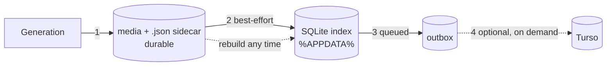

# Storage

Where everything lives on disk, and which parts are authoritative.



Step 1 is the commit. Everything after it is derived, and can be rebuilt from step 1
by `project_tags_reindex` or `project_reconcile`.

---

## App-level paths

`%APPDATA%\aiSLAP\` (`paths.rs`):

| File | Contents |
|---|---|
| `.env` | provider keys — see [providers.md](providers.md) §3 |
| `config.json` | ffmpeg path, colours, cached fal prices, price overrides, TOS config |
| `app-state.json` | last session: project/sequence/shot, chain links, iterations |
| `presets.json` | saved chain presets |
| `pending.json` | in-flight submissions, for orphan recovery |
| `db/<project-id>.db` | the local SQLite index, one file per project |

Plus `models_dir`, which is *resolved* rather than assumed — see
[model-registry.md](model-registry.md) §11.

## Project layout

**Native:**

```
project/
  project.json           project id, title, tagDefs, tagsMigrated, version prefix
  script.md              optional
  SRC/                   project-wide inputs
  TRASH/                 trashed media — see below
  <sequence>/
    sequence.json
    <shot>/
      shot.json          prompt history, version selects, minor counters, clip media
      SRC/               shot inputs
      SEL/               legacy — see below
      v001/ gen001/ …    one folder per generation batch
```

**PRISM:** the same, except the shot level is `<entity>/Renders/2dRender/AI`. See
[prism.md](prism.md).

> **`SEL/` is deliberate legacy.** It still renders as a gallery column where it
> exists, but nothing is ever moved into one — its role was replaced by the `select`
> tag. Every directory scan treats `SRC`, `SEL` and `.`/`$`-prefixed names as
> non-version folders.

## The media triple

```
clip.mp4            the media
clip.json           its sidecar — the durable record
clip.thumb.jpg      poster frame, for video (8-bit JPEG)
clip.thumb.png      poster frame, for 3D — the provider's RGBA preview
```

These move as a unit through copy, move, rename, **trash** and **export**. `fsutil.rs`
provides `sidecar_path`, `thumb_path`, `existing_thumb_path`, `thumb_path_like` and
`is_thumb` so no caller has to rebuild those names by hand — the export path silently
dropped thumbnails for exactly that reason before the helpers existed.

Two thumbnail suffixes are live, and the distinction is load-bearing:

- **`.thumb.jpg`** is what a video poster is written as now (`-pix_fmt yuvj420p -q:v 3`).
  The pixel format is pinned because a 10-bit source — Seedance 2.5 returns HEVC Main 10
  for some outputs — otherwise had ffmpeg emitting 16-bit `rgb48be` PNGs at ~8MB each,
  for a picture never shown above a few hundred pixels wide. The same frame is ~150KB
  as JPEG.
- **`.thumb.png`** is what every project generated before that switch is full of, and
  what a 3D preview still gets: those bytes are downloaded from the provider (Meshy
  ships an RGBA render, already ~130KB), never re-encoded, so flattening them to JPEG
  would only cost the transparency.

So *write* through `thumb_path` (canonical, always `.jpg`), *read* through
`existing_thumb_path` (prefers `.jpg`, falls back to `.png`, `None` for neither), and
when carrying a thumbnail alongside a move or rename use `thumb_path_like` so a legacy
PNG stays a PNG instead of having its bytes relabelled. `THUMB_SUFFIXES` in
`src/lib/media.ts` mirrors the Rust list for the frontend's guess-the-sidecar paths —
keep the two in step.

The sidecar carries the prompt pieces, the exact `combinedPrompt` sent, the settings,
a ref snapshot, the provider response, `costUsd`, the chain lineage, `tags`, `assetId`
and `contentHash`.

**Derived media.** The video trim (`video_trim` in `media.rs`, driven by `TrimMode`)
writes `<stem>_trim.mp4` beside its source and gives it a full triple, so it is the
first file aiSLAP creates that has one with no generation behind it. Its sidecar is
cloned from the source's, minus three fields: `tags` (a trimmed copy of the `select`
take is not itself the selected take), `costUsd` (the trim is local work — inheriting
it would double-count the clip in `project_cost_scan`), and a fresh `assetId` +
`contentHash`, because two files must never share an identity. `refs` stays the
*original generation's* inputs so RESTORE PROMPT still reproduces the generation
rather than the edit; the link back to the source lives in **`derivedFrom`**
(`{ op, path, assetId, startSec, endSec }`).

## TRASH

**There is no hard delete.** `image_trash` moves the whole triple into `<project>/TRASH/`
under a mirror of the file's project-relative path — `TRASH/SQ01/sh010/v003/clip.mp4` —
so where it came from is legible and two shots' identically-named files can't collide.
A name trashed twice gets `_1`, `_2` … appended, applied to all three companions at once
so the triple stays a set (`CollisionPolicy::Uniquify` in `image.rs`).

`TRASH` is excluded from every traversal, at **both** gates: `walk.rs::is_content_dir`
(which covers `project_walk`, `project_reconcile`, `project_cost_scan`, `timeline_init`
and `project_tag_scan`) and `fsutil.rs::list_dirs` (which fills the SEQUENCE dropdown).
Miss the second and a native project grows a `TRASH` sequence.

Trashing **purges** the file's index rows rather than relinking them — a row pointing
inside `TRASH` would never be revisited by reconcile yet would still answer tag queries.
Restoring is therefore just moving the file back out: `project_reconcile` re-ingests it
on the next project open and recovers its `assetId` from the embedded media id, and its
tags never left the sidecar.

**In a PRISM project nothing is trashed or deleted at all** — see [prism.md](prism.md).

## Asset identity

`media_id.rs` embeds an id **inside the media file** — EXIF UserComment for JPEG, a
text chunk for PNG, a private chunk for WebP, ffmpeg metadata for video — and mirrors
it, plus a content hash, into the sidecar. Embedding is best-effort: a format that
cannot carry one still gets an id in its sidecar.

- A **rename or move** keeps the id; `project_reconcile` relinks the index by it.
- A **copy** is deliberately re-identified with a fresh id (`reidentify_copy`), so two
  files never share one. Its tag rows are re-keyed to match.
- The **content hash** is streamed rather than read whole — this runs over every file
  in a project, and the media is routinely multi-gigabyte video.
- A sidecar that has **lost its `assetId`** gets the embedded one back rather than a
  fresh uuid. That is what embedding an id is *for*: minting a new one would orphan the
  existing index row and every tag on it. Reported as `identityRecovered`.

### What reconcile does, and what it deliberately misses

`project_reconcile` runs on every project open. It:

1. loads the whole index in two queries, rather than querying per file;
2. walks the project **off the async runtime** — a large project over SMB would
   otherwise pin a runtime worker for minutes;
3. decides per file, and applies every database change in **one transaction**.

**It does not re-hash a settled file.** A file that already carries both an `assetId`
and a `contentHash`, and is indexed at the path it actually sits at, is taken at its
word. Hashing everything on every open meant reading the entire project — often
gigabytes of video — to conclude "nothing changed", which it almost always had.

The trade: a file edited **in place** by another tool, keeping its path and its
sidecar, is no longer noticed. Anything that moves, is new, or has lost its identity
still is. `project_tags_reindex`, and deleting the index outright, both force a full
re-read.

## The SQLite index

Per project, under `%APPDATA%`, keyed by the project id. Tables: `assets`,
`asset_refs`, `asset_tags`, `outbox`, `projects` (plus `shot_state` and
`prompt_history`, created ahead of the feature that will use them).

It is a **cache**. Deleting it costs a reindex, not data.

**`projects` is the human-readable name for a `project_id`.** One row
(`project_id`, `title`, `updated_at`), refreshed by `sync_outbox` on every
call rather than queued through `outbox` — `outbox` is keyed by asset id, and
a title change has no asset to hang off. The title itself comes from
`commands::session::project_title_for`: a PRISM project's `pipeline.json`
`globals.project_name` when set, else the folder name — live-derived every
time, never trusted from the `title` stored in `project.json` at creation, so
a later pipeline.json edit doesn't go stale. This is what gives the remote
Turso database — genuinely multi-project, see below — a name to show next to
`project_id` in a cross-project report. The frontend derives the identical
value itself (`prism.projectName` from `prism_detect`, else the folder
basename) for the SessionBar label rather than round-tripping through a
command; keep the two derivations in lockstep if this rule ever changes.

Notes that are easy to get wrong:

- The local file is single-project, so `project_id` is a constant column in it. The
  local-only indexes (`SCHEMA_LOCAL`) therefore lead with `content_hash` / `rel_path`
  rather than `project_id`; the composite indexes in the shared schema are correct for
  the *remote* database, which genuinely holds many projects.
- **The remote `assets`/`asset_refs`/`asset_tags` are one shared table per name, not
  one per project.** Considered splitting by project when the `generated_by` index
  went in; rejected. SQLite's write lock and B-tree depth are functions of the
  *database*, not the table — more tables in the same Turso database buys no
  concurrency and no shallower lookups, and Turso bills rows read/written, not table
  count. A `project_id`-leading index already bounds a project's own queries to its own
  rows regardless of how large other projects grow. Splitting would also cost the one
  thing this shared remote db is *for*: `generated_by` + its index exist so a future
  "who generated what, for how much" report is one `GROUP BY` — splitting turns that
  into a cross-table union or, if split into per-project databases instead (the
  actually-correct way to get real isolation, per Turso's own multi-tenant guidance),
  a scheduled ETL job. Revisit only for a real compliance/isolation requirement or
  measured write contention — not for row count; low millions of rows per project is
  the point where a low-cardinality leading column would start to matter, and this
  isn't near it.
- The local db filename falls back to a hash of the project path when the project id
  hasn't been minted yet. `adopt_path_keyed_db` renames such a file into place once the
  id lands, so a first-open race doesn't strand a whole index.
- **Open `Database` handles are cached** per index file. Building one runs
  `create_dir_all`, opens the file and replays the whole schema, which per call turned
  batch work into an N+1. The cache holds the `Database`, not a `Connection`, so every
  caller still gets its own connection and transactions stay independent.
- **WAL and `busy_timeout` are set once**, at first open. WAL was pointless while the
  handle was discarded every call; `busy_timeout` matters because two aiSLAP windows
  share the file, and real transactions surface `SQLITE_BUSY` where the old per-row
  autocommits mostly got away with it.
- **Prefix queries use a range predicate**, not `LIKE` and not a full scan filtered in
  Rust: `rel_path = p OR (rel_path >= "p/" AND rel_path < "p0")`, since `'/' + 1 == '0'`.
  An index can serve that.
- **Batch writes are batched.** `assets_relink`, `assets_cost_update`, `assets_ingest`
  and `asset_tags_apply` each take a slice and run in one transaction. The per-row
  variants they replaced opened the database once per row.

## Outbox and Turso sync

Every index write also queues the asset id in `outbox`. There is **no background
timer** — the backend has no notion of an open project (see
[architecture.md](architecture.md) §2), so the frontend triggers `db_sync_outbox`
after asset writes and once per project open.

Sync is purely additive and entirely optional: with `TURSO_DATABASE_URL` /
`TURSO_AUTH_TOKEN` unset, the app is local-only and nothing about it degrades.

## Caching traps

- **`metadataCache.ts` assumes sidecars never change.** Tags broke that premise, hence
  `invalidateImageMetadata`. Anything new that mutates a sidecar must invalidate too.
- **Read-modify-write of `project.json` must use `read_json_strict`.** The lenient read
  returns a default for a damaged file, and the write that follows would commit that
  default — erasing the project id, title, migration flag and the entire tag
  vocabulary. The strict read errors instead, and copies the damaged file aside as
  `project.corrupt-<timestamp>`.
- **`write_json_atomic` renames but does not `fsync`.** A power loss can therefore
  land the rename before the data. Known gap, deliberately unaddressed pending
  measurement on SMB, where the extra round trip is expensive.
- **A partially-written file can be scanned.** The accidental guard is that generation
  writes media *then* sidecar, and reconcile skips sidecar-less files. Anything that
  starts hashing files without sidecars removes that guard.
